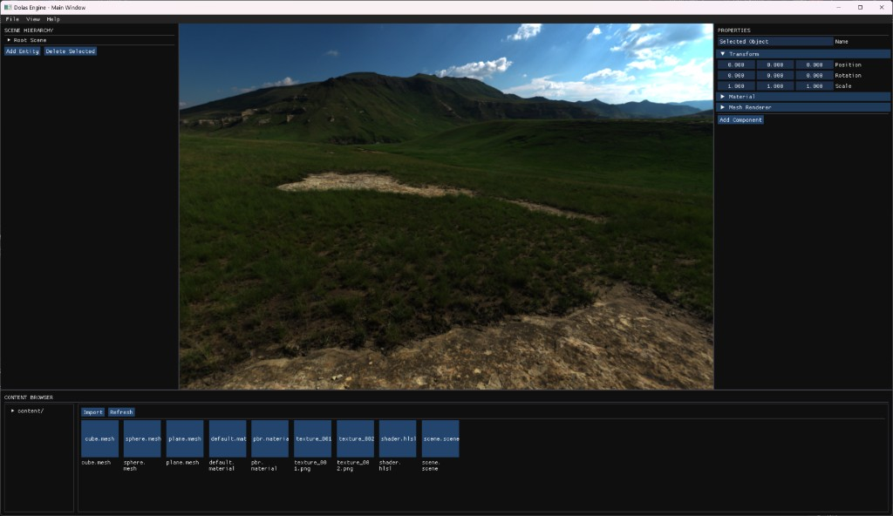

# Dolas 引擎



Dolas 是一个基于 DirectX 11 的轻量级游戏引擎，使用 C++20 开发。项目采用模块化设计，旨在提供高性能、可扩展的开发框架。

## 特性

- 🎮 **现代渲染管线**: 基于 DirectX 11 的高效渲染实现。
- 🧱 **模块化架构**: 
  - `engine_runtime`: 核心运行时，包含平台抽象、数学库、资源管理和基础功能。
  - `engine_tool`: 开发工具，包括场景编辑器和离线着色器编译器。
  - `engine_test`: 基于 Catch2 的自动化单元测试。
- 📦 **依赖管理**: 使用 Git Submodule 管理第三方库，保证版本一致性。
- 📊 **性能分析**: 集成 Tracy Profiler，支持实时性能瓶颈分析。
- 🎨 **资源处理**: 支持 DDS 纹理（DirectXTex）、3D 模型（Assimp）加载。
- 🖼️ **图形界面**: 集成 ImGui（支持 Docking 和多视口），用于开发工具和调试。
- 📝 **日志系统**: 使用 spdlog 提供的线程安全、高性能日志记录。

## 项目结构

```
dolas/
├── src/                    # 源代码
│   ├── engine_runtime/     # 引擎运行时模块
│   │   ├── dolas_core/     # 核心基础类（数学、哈希、基础类型）
│   │   ├── dolas_platform/ # 平台抽象（窗口管理、输入）
│   │   ├── dolas_resource/ # 资源管理（纹理、模型、材质加载）
│   │   └── dolas_function/ # 高级功能（渲染逻辑、世界系统）
│   ├── engine_tool/        # 开发工具
│   │   ├── dolas_editor/   # 场景/引擎编辑器
│   │   └── dolas_shader_compiler/ # 着色器离线编译工具
│   └── engine_test/        # 单元测试（基于 Catch2）
├── third_party/            # 第三方库（Git Submodule）
├── content/                # 原始资源文件（Shader, Texture, Material等）
├── docs/                   # 项目文档与规范
├── build/                  # 构建输出目录（由 CMake 自动生成）
├── setup.bat               # 环境初始化脚本（生成 VS 项目）
└── build-debug.bat         # 快速构建脚本
```

## 构建要求

- **操作系统**: Windows 10 或更高版本
- **编译器**: Visual Studio 2022 (v143) 或更高版本（需支持 C++20）
- **CMake**: 3.20 或更高版本
- **Git**: 用于克隆仓库和管理子模块

## 快速开始

### 1. 克隆项目（包含子模块）

```bash
# 克隆主仓库和所有子模块
git clone --recursive https://github.com/yaomq19/dolas.git
cd dolas

# 如果已经克隆了主仓库，初始化子模块
git submodule update --init --recursive
```

### 2. 初始化环境

运行根目录下的 `setup.bat`。该脚本会自动创建 `build` 目录并为 Visual Studio 2022 生成项目文件。

```powershell
.\setup.bat
```

### 3. 构建项目

你可以直接在根目录下使用预设的批处理文件进行快速构建：

- **Debug 版本**: `.\build-debug.bat`
- **Release 版本**: `.\build-release.bat`

或者使用 CMake 手动构建：

```bash
cmake --build build --config Debug -j16
```

### 4. 运行

构建成功后，可执行文件位于 `build/bin/` 目录下：

- **编辑器**: `build\bin\Debug\DolasEditor.exe`
- **着色器编译器**: `build\bin\Debug\ShaderCompiler.exe`
- **单元测试**: `build\bin\Debug\DolasTest.exe`

## 第三方库

本项目通过 Git Submodule 管理以下依赖：

| 库名 | 用途 | 许可证 | 仓库 |
|------|------|--------|------|
| [ImGui](https://github.com/ocornut/imgui) | 即时模式 GUI (docking) | MIT | [yaomq19/imgui](https://github.com/yaomq19/imgui) |
| [Assimp](https://github.com/assimp/assimp) | 3D 模型加载 | BSD-3-Clause | [yaomq19/assimp](https://github.com/yaomq19/assimp) |
| [spdlog](https://github.com/gabime/spdlog) | 快速日志库 | MIT | [yaomq19/spdlog](https://github.com/yaomq19/spdlog) |
| [DirectXTex](https://github.com/microsoft/DirectXTex) | DirectX 纹理处理 | MIT | [yaomq19/DirectXTex](https://github.com/yaomq19/DirectXTex) |
| [Tracy](https://github.com/wolfpld/tracy) | 性能分析工具 | BSD-3-Clause | [yaomq19/tracy](https://github.com/yaomq19/tracy) |
| [Catch2](https://github.com/catchorg/Catch2) | 单元测试框架 | BSL-1.0 | [yaomq19/Catch2](https://github.com/yaomq19/Catch2) |
| [TinyXML2](https://github.com/leethomason/tinyxml2) | XML 解析 | Zlib | [yaomq19/tinyxml2](https://github.com/yaomq19/tinyxml2) |

## 开发文档

- 编码规范与路线图：[Developer.md](Developer.md)
- 详细设计与规范：[docs/](docs/)

## 许可证

本项目采用 MIT 许可证。详情请参阅 [LICENSE](LICENSE) 文件。
