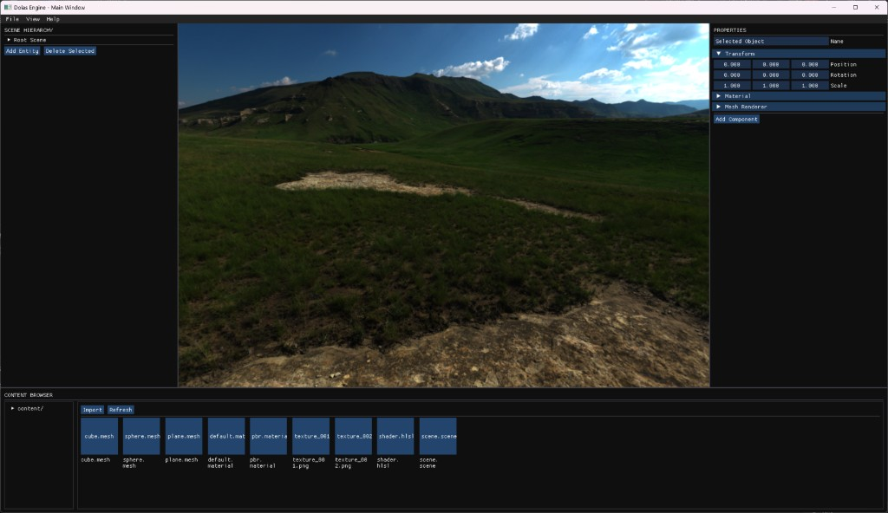

# Dolas Engine



Dolas is a lightweight game engine built with C++20, targeting Windows. It features a deferred rendering pipeline and a modular architecture designed for extensibility. The engine is currently in the process of migrating from DirectX 11 to DirectX 12.

## Features

- **Deferred Rendering Pipeline**: Multi-pass pipeline (Clear → GBuffer → DeferredShading → ForwardShading → Skybox → Debug → ImGUI → PostProcess → Present), currently D3D11-based with D3D12 migration in progress.
- **Modular Architecture**: Four-layer design — `DolasPlatform` (windowing, D3D12 device init, logging, thread pool), `DolasCore` (math, hashing, path utilities), `DolasResource` (RSD asset system with XML deserialization), `DolasFunction` (18 managers, render layer, editor layer).
- **Asset System**: RSD (Resource Schema Definition) based asset pipeline with `AssetManager` for loading/deserializing typed assets from XML.
- **Editor**: ImGui-based scene editor with docking and multi-viewport support, including content browser for asset management.
- **Performance Profiling**: Integrated Tracy profiler for real-time performance analysis.
- **Resource Processing**: DDS texture loading via DirectXTex, 3D model import via Assimp.
- **Logging**: Thread-safe, high-performance logging via spdlog.

## Project Structure

```
dolas/
├── src/
│   ├── engine_runtime/
│   │   ├── dolas_platform/     # Platform abstraction (window, D3D12 device, logging, file system, thread pool)
│   │   ├── dolas_core/         # Core types, math library, hash utilities, path resolution
│   │   ├── dolas_resource/     # RSD asset system (AssetManager, XML deserialization)
│   │   └── dolas_function/     # Engine layer: managers, render pipeline, editor GUI
│   ├── engine_tool/
│   │   ├── dolas_editor/       # Scene/engine editor executable
│   │   └── dolas_shader_compiler/  # Offline shader compiler (standalone, no engine deps)
│   └── engine_test/            # Catch2 unit tests (asset manager, math, path utilities)
├── third_party/                # Third-party dependencies (git submodules)
├── content/                    # Raw assets (shaders, textures, materials, etc.)
├── docs/                       # Documentation and specifications
├── build/                      # CMake build output (build/vs2022-debug/, build/vs2022-release/)
└── CMakeLists.txt
```

## Build Requirements

- **Operating System**: Windows 10 or later
- **Compiler**: Visual Studio 2022 (v143) with C++20 support
- **CMake**: 3.15 or later
- **Git**: For cloning the repository and managing submodules

## Quick Start

### 1. Clone the Repository (with Submodules)

```bash
git clone --recursive https://github.com/yaomq19/dolas.git
cd dolas

# If already cloned without submodules:
git submodule update --init --recursive
```

### 2. Configure

```bash
cmake --preset vs2022-debug
```

### 3. Build

```bash
# Debug
cmake --build --preset vs2022-debug -j16

# Release
cmake --build --preset vs2022-release -j16
```

### 4. Run

Executables are output to `build/<preset>/bin/`:

- **Editor**: `build/vs2022-debug/bin/DolasEditor.exe`
- **Shader Compiler**: `build/vs2022-debug/bin/ShaderCompiler.exe`
- **Unit Tests**: `build/vs2022-debug/bin/DolasTest.exe`

Run all tests via CTest:

```bash
cd build/vs2022-debug && ctest --config Debug
```

## Architecture

```
DolasEditor (app)        ShaderCompiler (standalone tool)
    └─ DolasFunction          └─ d3dcompiler only
          ├─ DolasResource
          ├─ DolasCore
          └─ DolasPlatform
```

- **DolasPlatform** — Lowest layer. Window creation, D3D12 `RenderHardwareInterface`, logging macros, file system, thread pool.
- **DolasCore** — Fundamental types, math library (`dolas_math.h`), hash utilities (`STRING_ID` macro, `HashConverter`), path resolution.
- **DolasResource** — RSD asset system. `AssetManager` loads typed assets (Material, Mesh, Entity, Camera, Scene) from XML.
- **DolasFunction** — The main engine library, organized into three areas:
  - **Manager layer**: `DolasEngine` singleton owns 18 managers (`MeshManager`, `TextureManager`, `ShaderManager`, `MaterialManager`, `RenderPipelineManager`, `ImGuiManager`, `TaskManager`, etc.).
  - **Render layer**: `DolasRHI` (D3D11-based, migrating to D3D12), multi-pass `RenderPipeline`, resource wrappers (`Buffer`, `Texture`, `Shader`, `Material`).
  - **Editor layer**: `ContentBrowser` and ImGui-based tooling.

## DX11 to DX12 Migration

The engine is mid-migration. Current state:

- `dolas_platform/dolas_render_hardware_interface.cpp` already links `d3d12.lib` and creates a D3D12 device and command queue.
- `dolas_function/dolas_rhi.cpp` and all render layer code still use D3D11 (`d3d11.lib`, `dxgi.lib`, `d3dcompiler.lib`).
- See [docs/DX12迁移计划.md](docs/DX12迁移计划.md) for the full 8-phase migration plan.

## Third-Party Dependencies

All managed via git submodules under `third_party/`:

| Library | Purpose | License | Upstream |
|---------|---------|---------|----------|
| [ImGui](https://github.com/ocornut/imgui) | Immediate-mode GUI (docking) | MIT | [yaomq19/imgui](https://github.com/yaomq19/imgui) |
| [ImGuizmo](https://github.com/CedricGuillemet/ImGuizmo) | 3D gizmo manipulation | MIT | [yaomq19/ImGuizmo](https://github.com/yaomq19/ImGuizmo) |
| [Assimp](https://github.com/assimp/assimp) | 3D model loading | BSD-3-Clause | [yaomq19/assimp](https://github.com/yaomq19/assimp) |
| [DirectXTex](https://github.com/microsoft/DirectXTex) | DirectX texture processing | MIT | [yaomq19/DirectXTex](https://github.com/yaomq19/DirectXTex) |
| [spdlog](https://github.com/gabime/spdlog) | Fast logging library | MIT | [yaomq19/spdlog](https://github.com/yaomq19/spdlog) |
| [Tracy](https://github.com/wolfpld/tracy) | Performance profiler | BSD-3-Clause | [yaomq19/tracy](https://github.com/yaomq19/tracy) |
| [Catch2](https://github.com/catchorg/Catch2) | Unit testing framework | BSL-1.0 | [yaomq19/Catch2](https://github.com/yaomq19/Catch2) |
| [TinyXML2](https://github.com/leethomason/tinyxml2) | XML parser | Zlib | [yaomq19/tinyxml2](https://github.com/yaomq19/tinyxml2) |

## Documentation

- [Developer.md](docs/Developer.md) — Coding conventions and resource ID hashing guidelines
- [docs/](docs/) — Detailed design docs, DX12 migration plan, editor development notes

## License

This project is licensed under the MIT License. See [LICENSE](LICENSE) for details.
